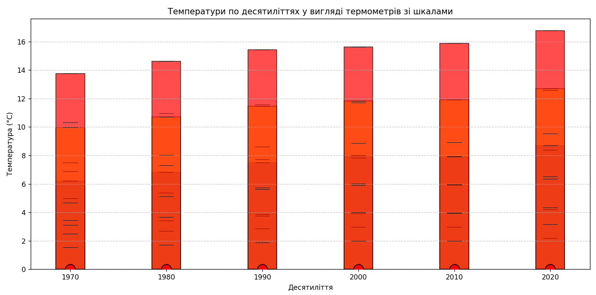
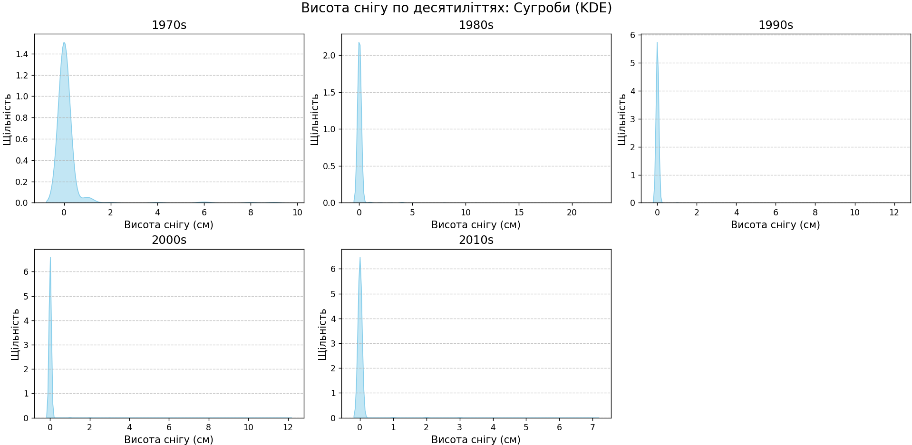
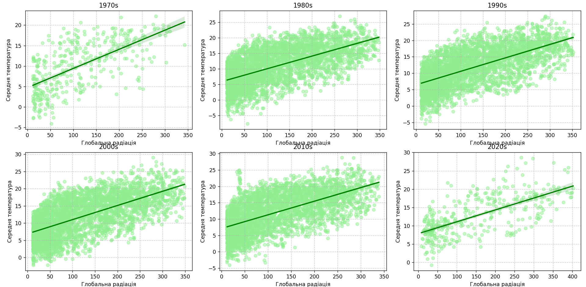
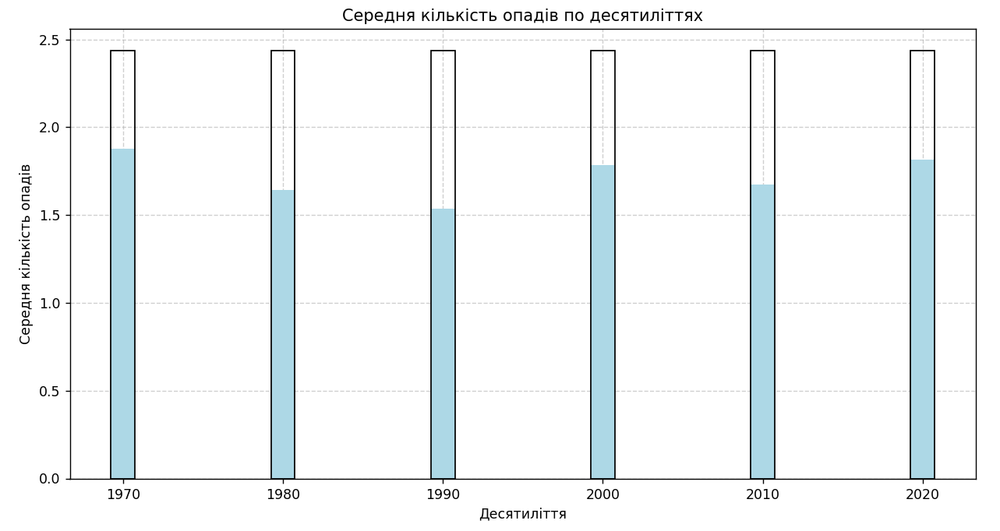
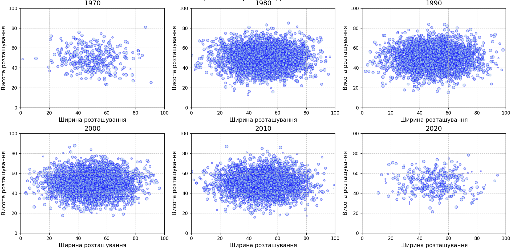
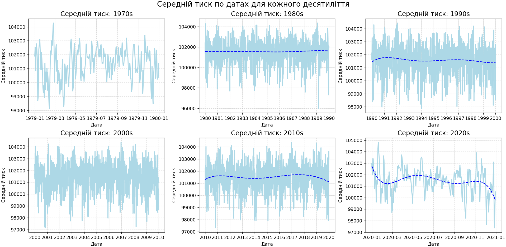
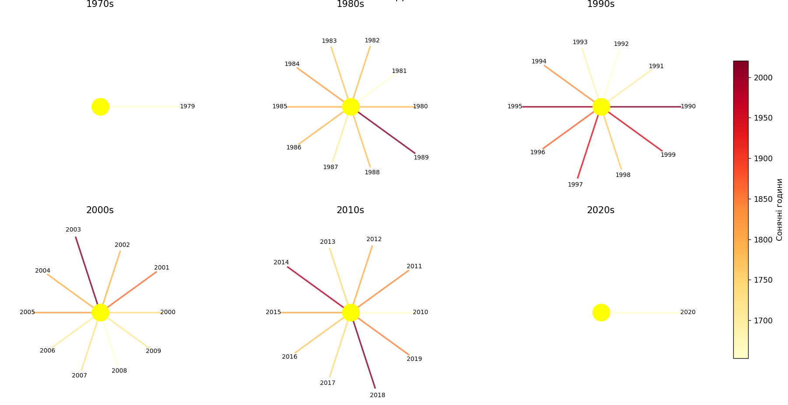
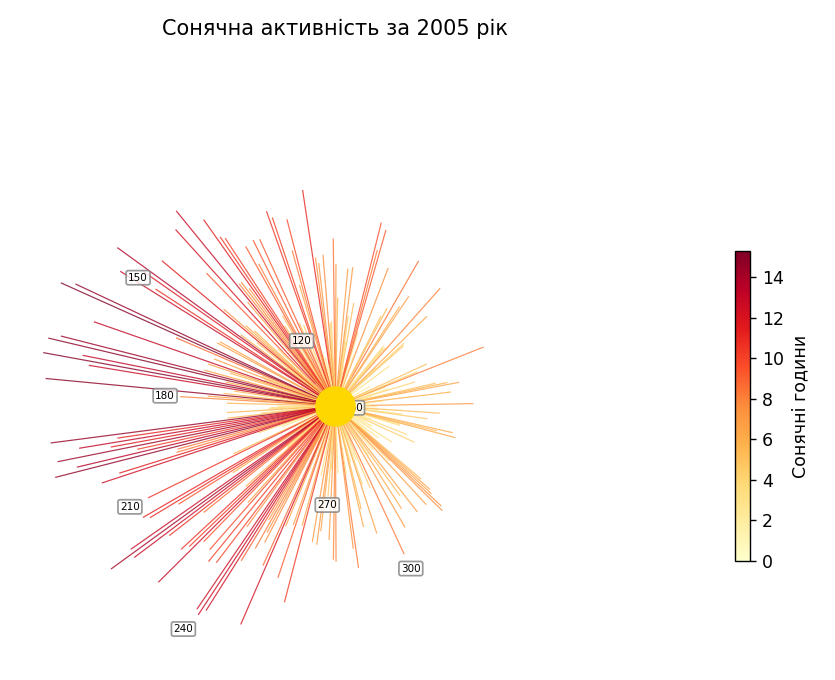

# Weather Conditions Visualization

A library for visualizing weather conditions that allows you to create graphs of temperature, precipitation, snow cover, wind speed, cloudiness, sunshine hours, and solar radiation.

## Installation

```bash
pip install weather_visualization
```

## Usage
```
from weather_visualization import WeatherDataPlotter

# Loading data
data = pd.read_csv(r"E:\projects\Python\PP\src\london_weather.csv")

# Creating visualizations
plotter = WeatherDataPlotter(data, 'date')

# Available visualizations
```
plotter.plot_temperature_with_scales("min_temp", "mean_temp", "max_temp")    # Temperature
    
plotter.plot_snow_depth("snow_depth")                                        # Snow cover
    
plotter.plot_radiation("global_radiation", "mean_temp")                      # Solar radiation
    
plotter.plot_precipitation("precipitation")                                  # Precipitation
    
plotter.plot_cloud_cover("cloud_cover")                                      # Cloud cover
   
plotter.plot_pressure("pressure", "date")                                    # Pressure
   
plotter.plot_sunshine("sunshine","date")                                     # Sunshine during decade
   
plotter.plot_sunshine_year(2005, "sunshine", "date")                         # Sunshine during year
   
plotter.weather_report("date", "sunshine", "mean_temp", "precipitation")     # General report about sunny days, prepitiation and temperatute
```